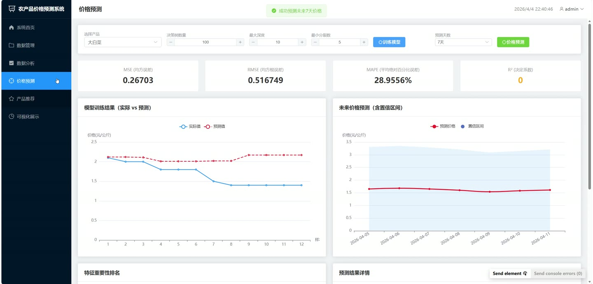
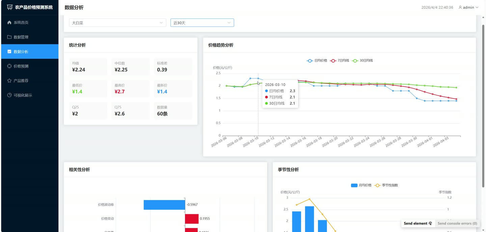
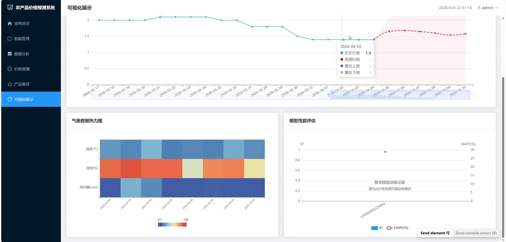
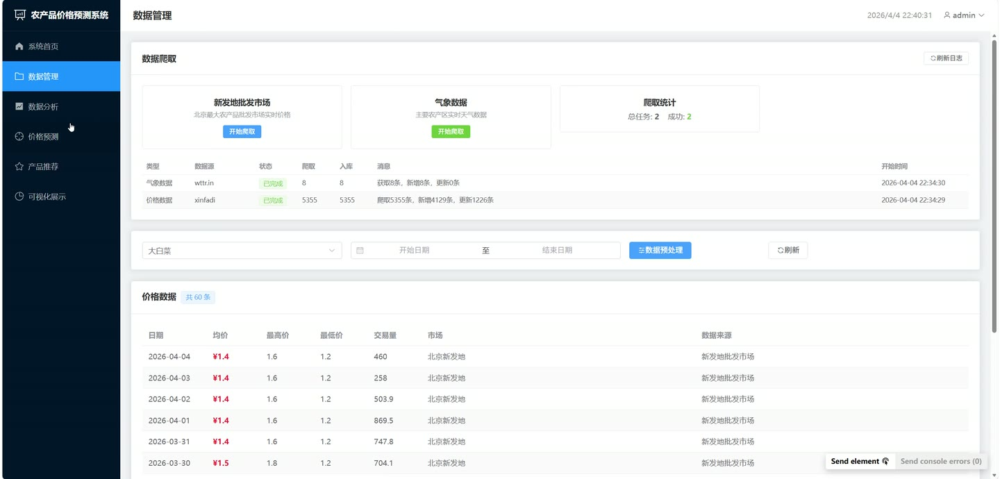
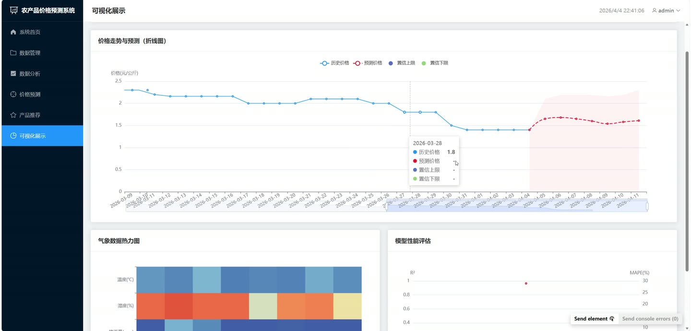

# (附文档)Python+机器学习+Vue3 基于机器学习的农产品价格预测系统

**技术栈**：Python、Django、机器学习、Vue3、MySQL

### 系统简介

本系统是一套基于 Django REST Framework 与 Vue3 前后端分离架构的农产品价格预测平台，围绕农产品价格数据采集、预处理、统计分析、机器学习预测、智能推荐与可视化展示构建完整业务闭环。系统内置管理员角色，通过登录鉴权后进入统一后台，完成从数据爬取到模型训练与预测输出的全流程操作。
 
### 核心功能
 
### 管理员端

 
- 账号登录与鉴权：通过用户名密码登录获取 token 与 refresh token，支持 token 刷新、退出登录及路由守卫拦截。 
- 修改密码：登录后可调用修改密码接口更新当前账号密码。 
- 系统首页仪表盘：展示农产品种类、价格记录数、预测记录数、推荐记录数四项统计卡片，并列出各农产品最新价格与更新日期。 
- 数据爬取：可一键触发新发地批发市场价格爬取与气象数据爬取，后台线程异步执行，支持按产品名指定爬取对象。 
- 爬取日志查看：以表格展示爬取类型、数据源、运行状态、爬取条数、入库条数、消息与开始时间。 
- 价格数据管理：按产品与日期区间筛选价格记录，分页展示日期、均价、最高价、最低价、交易量、市场与数据来源。 
- 数据预处理：对指定产品执行缺失值填补、异常值剔除、价格变化率与季节性指数计算、特征标准化，并生成处理日志。 
- 处理日志查看：展示总记录数、已处理记录数、填补缺失值数、剔除异常值数与处理状态。 
- 统计分析：查看指定产品的均值、中位数、标准差、最低价、最高价、最新价、Q25、Q75 与数据量。 
- 趋势分析：按近 30/90/180/365 天查看日均价格、7 日均线、30 日均线与日涨跌幅折线图。 
- 相关性分析：计算价格与最高价、最低价、交易量、价格波动率、温度、湿度、降雨量、库存量、销售量的相关系数并绘制条形图。 
- 季节性分析：按月统计月均价格、最低价、最高价、季节性指数，按季度统计均价并绘制柱线组合图。 
- 模型训练：设置树的数量、最大深度、最小样本分裂数、测试集比例，训练随机森林模型并保存模型版本。 
- 模型评估：查看 MSE、RMSE、MAPE、R² 决定系数、训练集与测试集大小及特征重要性。 
- 价格预测：选择 7 天或 30 天预测未来价格，输出预测价格与置信区间上下限并保存预测结果。 
- 预测对比：查看预测价格与实际价格对比数据。 
- 产品推荐生成：按种植建议、采购建议、销售建议类型生成推荐，含推荐等级、推荐理由、预测趋势、预测价格、置信度与有效期。 
- 可视化展示：提供仪表盘、价格走势图、供需关系柱状图、气象热力图、模型性能对比图与预测实际对比图数据接口。
 
### 技术栈

 后端框架Python + Django + Django REST Framework ORMDjango ORM（ModelViewSet / ReadOnlyModelViewSet） 权限认证IsAuthenticated + Token 鉴权 + 自定义 auth_views 机器学习scikit-learn 随机森林（n_estimators / max_depth / min_samples_split） 数据处理pandas + numpy 前端框架Vue3 + Element Plus 前端路由Vue Router（createWebHistory + 路由守卫） 图表库ECharts 数据库MySQL
 
### 交付内容

 
- 后端完整源码 
- 前端完整源码 
- 数据库初始化脚本 
- 万字文档

## 界面展示

---

## 获取完整源码 + 万字文档

本仓库为项目介绍页。**完整前后端源码、数据库初始化脚本、万字项目文档**，请加微信 `kangkangcode`，或访问 [codekk.top](http://codekk.top) 获取。

可作课程设计 / 毕业设计参考，支持远程部署调试。